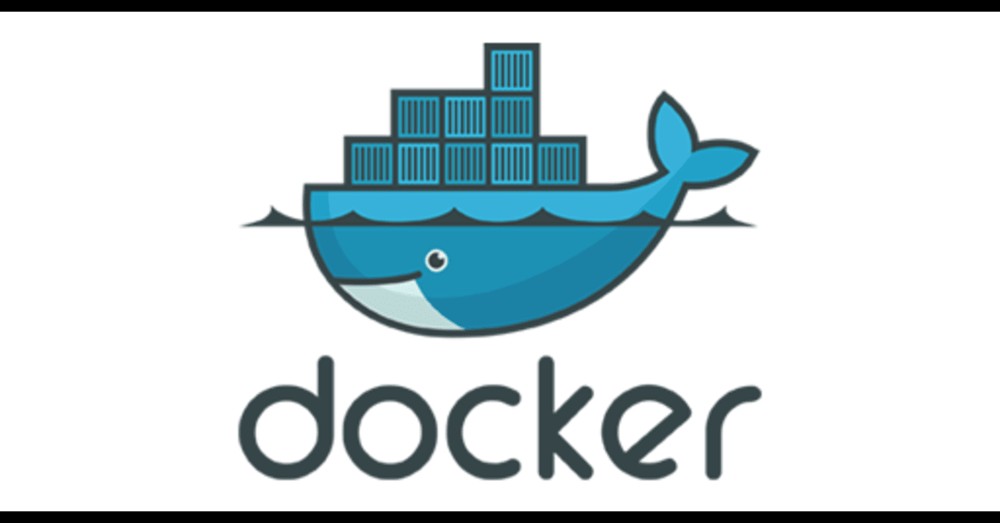

# Docker

## Intro

**Docker** is a platform that allows developers to easily create, deploy, and run applications in a container. Containers are lightweight, portable, and self-sufficient, making them an ideal solution for developing, testing, and deploying applications as well as packaging and distributing software.

### Usage

One of the main benefits of using Docker is the ability to easily manage dependencies and isolate applications from each other, ensuring that they run consistently across different environments. This makes it ideal for use in a variety of scenarios, including development, testing, and production.

Docker is also particularly useful for microservices, as it allows each service to run in its own container, with its own dependencies and environment. This makes it easy to scale and manage the services, and also allows for easy deployment to different environments.

### Installation

To install Docker on a Linux system, you will need to first ensure that your system meets the minimum requirements. This typically includes a 64-bit version of Linux and a kernel version of 3.10 or higher. Once these requirements are met, you can install Docker using the package manager for your specific Linux distribution or alternatively install docker by following the instructions on the [Docker website](https://docker.com). The process typically involves adding the Docker repository to your system, and then installing the Docker engine.

### Basic Commands

Once Docker is installed, you can start using it by running basic commands in the command line. Some of the most commonly used commands to manage containers include:

1. `docker run`: This command is used to run a container from a specified image.
  
2. `docker start`: This command is used to start a stopped container.
  
3. `docker stop`: This command is used to stop a running container.
  
4. `docker images`: This command is used to list all of the images on your system.
  
5. `docker ps`: This command is used to list all of the running containers on your system.
  
6. `docker rm`: This command is used to remove a container from your system.
  
7. `docker rmi`: This command is used to remove an image from your system.
  
8. `docker pull`: This command pulls an image from a registry, such as Docker Hub.
  
9. `docker push`: This command pushes an image to a registry.
  
## Conclusion

In conclusion, Docker provides a powerful platform for packaging and deploying applications in a container. Its ease of use and flexibility make it a popular choice among developers and operations teams not forgetting it is an essential tool for any system administrator. With the basic commands and usage of this technology, you can easily manage containerized applications and services.

> You can find a Docker cheatsheet [here](https://docs.docker.com/get-started/docker_cheatsheet.pdf)
