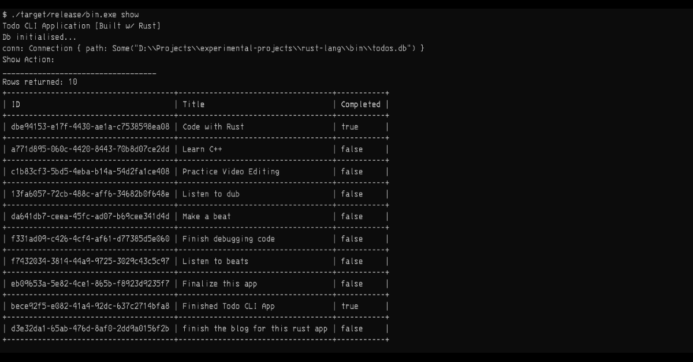
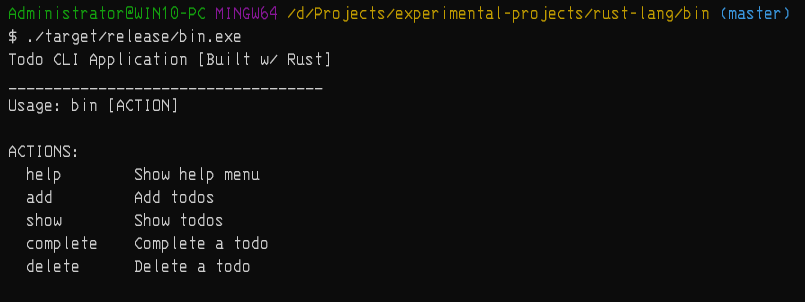
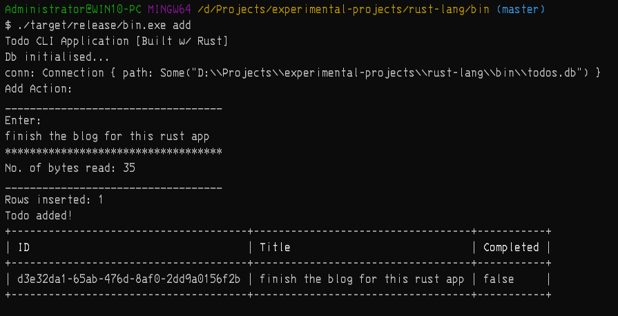

## Prerequisites

Make sure these programs are installed so that you can continue with the tutorial:

1. Rust compiler - version 1.67.0 (or other newer versions).

2. Any DBMS of your choice (in my case Beekeeper Studio Community Edition) - for viewing the database records (_of which is **OPTIONAL** because we are still going to access our d ata using our app_)

## Why use Rust?

I chose the language just because it boasts about the following:

1. It is a strongly statically typed programming language.

2. It is a memory safe programming language.

3. It has no garbage collection, hence code thats passes through the Rust compiler without errors is guaranteed to run safely on any system.

> 🚩 This tutorial is for intermediate programmers who have had enough introduction of the Rust programming language. In addition, this content is not endorsed or affiliated with the Rust Foundation.

### Rust Crates Used

The libraries that are going to be used include:

1. rusqlite - for allowing SQLite database connections.

2. prettytable-rs - for showing tables in the console.

3. uuid - for generating random UUIDs for identifying database records uniquely

> 📌 **Note**: there is also another crate`async-std` in the [Cargo.toml](https://github.com/MikeTeddyOmondi/todo-cli-app/blob/master/Cargo.toml) (the project's dependency file) but it is not going to be used in this tutorial.

### Intro:

As mentioned in the title of this blog, we are going to build a command-line interface (**CLI**) application that will allow us create, read, update and delete todos - a basic scenario for learning new programming languages. Data will be persisted using SQLite database.

> 📌 **Note**: that this application is not to be confused with an API built on Rust's web frameworks!

Here is a sneak peek of the program we would have after this tutorial:



#### Creating a new Rust application...

To create a new application we'll use [**cargo**](https://github.com/rust-lang/cargo) _(a build tool and also a package manager for Rust. It is used for scaffolding new library/binary projects)_. So in your projects folder, you can run this command in your terminal:

```rust
cargo new <PROGRAM_NAME_HERE>
```

> 📌 I highly recommend you use Rust's official documentation to refer anything that isn't clear

#### Command-Line Arguments...

First, to get user commands we will use `std::env` import to get all the entered commands from console. The application will take the command-line arguments and store them in a [**vector**](https://doc.rust-lang.org/stable/book/ch08-00-common-collections.html) _(a resizable array of elements of type T, allocated on the heap)_. Our vector array will be of type `String`. This is done using the following line:

```rust
let args: Vec<String> = env::args().collect();
```

#### Actions...

Secondly, we have to think of how users will interact with the CLI application through actions they want to take in relation to business logic to be implemented. These actions have been stored in an [enum](https://doc.rust-lang.org/stable/book/ch06-00-enums.html) _(a data structure that allow us to choose one value from different types of values)_ and they include the **ADD** action to add todos to the database, **SHOW** action that will show all todos in the database, **COMPLETE** action that will allow flag a todo as completed, **DELETE** action that will allow remove todos in the database and **HELP** action that will allow printing out to the console the help information for navigating through the application.

```rust
    // Actions Enum
    #[derive(Debug)]
    enum Actions {
        ADD,
        SHOW,
        HELP,
        DELETE,
        COMPLETE,
    }
```

These actions entered through the console will help the application determine what the user actually wants to do and we are going to do pattern matching with the help of the **match** expression _(which is a way to check whether a value follows a certain pattern and executes different codes for different patterns)_. Match expression has been rigorously use in this code because it is efficient, handles errors gracefully and makes coding in Rust easier. To match the given action argument provided in the console by the user we use the code below to store the Action type in the action variable. Also if a user doesn't provide any action argument we'll print the help information.

```rust
    // If no action argument is provided, we print the help info
    if args.len() != 2 {
        print_help();
        return;
    }

    // take the second argument which is the action
    // cause the program is the first argument
    // Looks like this: program.exe action
    let action_arg = args[1].trim().to_lowercase().to_owned();

    // strings allowed to be entered on the console
    let add_value: String = "add".to_owned();
    let show_value: String = "show".to_owned();
    let help_value: String = "help".to_owned();
    let delete_value: String = "delete".to_owned();
    let complete_value: String = "complete".to_owned();

    let action: Actions = match action_arg {
        add if add == add_value => Actions::ADD,
        show if show == show_value => Actions::SHOW,
        help if help == help_value => Actions::HELP,
        delete if delete == delete_value => Actions::DELETE,
        complete if complete == complete_value => Actions::COMPLETE,
        _ => Actions::HELP,
    };
```

#### Database Connection...

Thirdly, we should have dealt with the database connection first but anyway we are here now. I decided to use SQLite database because of its portability and its vast adoption among programmers as per the [Stack Overflow Survey 2023](https://survey.stackoverflow.co/2023/#most-popular-technologies-database) for databases; it will allow the application function on any kind of operating system.

We are going to add new cargo package referred to as rusqlite with bundled features on. So on the console:

```shell
cargo add rusqlite --features bundled
```

Import the package in the beginning of the project file as below:

```rust
use rusqlite::{Connection, Error, Result};
```

Before moving on with database connection we should also think about the structure of a single todo record that wil lbe stored in the database. The structure I used was a [struct](https://doc.rust-lang.org/stable/book/ch05-00-structs.html) _(a data structure that allows us to get multiple values under the same variable)_ to hold the different types of information I want it to hold. We will also use the `#[derive(Debug)]` attribute that tells the compiler to automatically generate the code to be able to print a debug representation of the structure - as used on the enum structure above - and also the `#[derive(Clone)]` attribute allows cloning a varible to other functions instead of moving them. This is a concept specific to Rust proamming language under [ownership & borrowing](https://doc.rust-lang.org/stable/book/ch04-00-understanding-ownership.html). The Todo struct will look like this:

```rust
// Todo Struct
#[derive(Debug, Clone)]
struct Todo {
    id: String,
    title: String,
    completed: bool,
}
```

To initialise a database connection, we will use a fucntion that will run in the main function anytime the program is run and provide the database connection for other functions to use. The function will also be responsible for creating the `todos` table. This function will return a [Result](https://doc.rust-lang.org/stable/book/ch09-02-recoverable-errors-with-result.html) enum which may have the returned database connection value of `Connection` type or the error value of which in this case will be a `rusqlite::error` type as imported earlier.

```rust
// Initialise the database and the table(s)
fn init_db() -> Result<Connection, Error> {
    let conn = Connection::open("todos.db")?;

    conn.execute(
        "create table if not exists todos (
             id text primary key,
             title text not null,
             completed boolean not null
        )",
        (),
    )?;

    Ok(conn)
}
```

#### Accepting User Input...

Fourthly, we should also think of how we are going to accept user input after the progran has run - i.e. after user has provided the action arguments and the program is running. That will require us to accept input for the actions that require creating, updating and deleting i.e. the ADD, COMPLETE and DELETE actions and input them in a buffer for processing with the application.

The function that will will be use is as follows, it will take no parameters and return a value of `String` type snd this is the mutable `line` variable at the end of the function as it does not end with a semicolon denoting it will returned after the function runs.

```rust
// accepting user input from the console
fn user_input() -> String {
    let mut input_buffer = String::new();
    println!("Enter: ");
    let bytes_read = std::io::stdin().read_line(&mut input_buffer).unwrap();
    println!("No. of bytes read: {}", bytes_read);
    input_buffer
}
```

#### Pretty Tables...

Lastly, after accepting user input it reached the time for displaying what we have in our database. I did not want to use the same old `println` macro for this. Then came the research part for a cargo package that could satisfy this requirement. I wanted the library to be able to display the database records i a tabular format, and thus found the [prettytabl-rs](https://github.com/phsym/prettytable-rs) cargo package. It is an easy to use package and so I chose it.

To add it as a project dependency, run:

```shell
cargo add prettytable-rs
```

Import it to the project together with the macros and use it by initialising the Table constructor, add the rows using the `add_row()` function and printing out the table using the `printstd()` function

```rust
// imports
#[macro_use]
extern crate prettytable;

use prettytable::Table;

// ...rest of the code

// code snippet: Prettytable
// Create table
let mut todos_table = Table::new();
// Add a row per time
todos_table.add_row(row![b->"ID", b->"Title", b->"Completed"]);
todos_table.add_row(row![todo.id, todo.title, todo.completed]);
// Print the table to stdout
todos_table.printstd();

// ...rest of the code
```

### Conclusion

As we concludethis tutorial, I want to leave at least one implementation of the Actions `enum` i.e. the ADD action to show how we take the user input, save it to the database using another function and display it to the console using `prettytable-rs` package.

```rust
// Function to add user input(the todo title) to the database
fn add_todo(conn: Connection, todo: Todo) -> Result<usize, Error> {
    // println!("Todo: {:?}", todo);
    let result = conn.execute(
        "INSERT INTO todos (id, title, completed) values (?1, ?2, ?3)",
        [todo.id, todo.title, (todo.completed as i32).to_string()],
    )?;
    Ok(result)
}

// inside the main function
// after getting the database connection
// we use pattern matching against all Actions available
match action {
    Actions::ADD => {
        println!("Add Action: ");
        let input = user_input();

        // Initialise a Todo struct
        let todo = Todo {
            id: Uuid::new_v4().to_string(),
            title: input.trim().to_owned(),
            completed: false,
        };

        // Add the todo to the database and get back the result enum
        let db_result = add_todo(conn, todo.clone());

        // Pattern matching db_resullt: Result enum Type
        match db_result {
            Ok(usize) => {
                println!("Rows inserted: {:?}", usize);
                println!("Todo added!");

                // Create table
                let mut todos_table = Table::new();

                // Add a row per time
                todos_table.add_row(row![b->"ID", b->"Title", b->"Completed"]);
                todos_table.add_row(row![todo.id, todo.title, todo.completed]);

                // Print the table to stdout
                todos_table.printstd();
            }
            Err(err) => {
                println!("An error occured while inserting database record: {}", err)

            }
        }
    }
// the rest of the patterns to be matched against continue here...
    Actions::SHOW => {}
    Actions::COMPLETE => {}
    Actions::DELETE => {}
    Actions::HELP => {}
}
```

On the console while running the program with the add action argument, here is how the program outputs:



Also note we had to borrow the `Connection` struct in the `COMPLETE` action as you'll see in the full source code [here](https://github.com/MikeTeddyOmondi/todo-cli-app) so that the connection variable (named as `conn`) won't be moved and it will only be copied by the `complete_todo()` function so that the other function within the same scope i.e. the `show_one()` function will be able to use the same connection variable

Honestly, this was a great moment for me to get my feet wet on Rust fundamentals and learn as much as I could becase I know and I have seen the potential in this new modern approach it brings to systems programming.

Be sure to get the full source code on [GitHub](https://github.com/MikeTeddyOmondi/todo-cli-app) and you can fork it and provide more enhancements to it and drop a pull request for new features and bug-related issues in the future.
